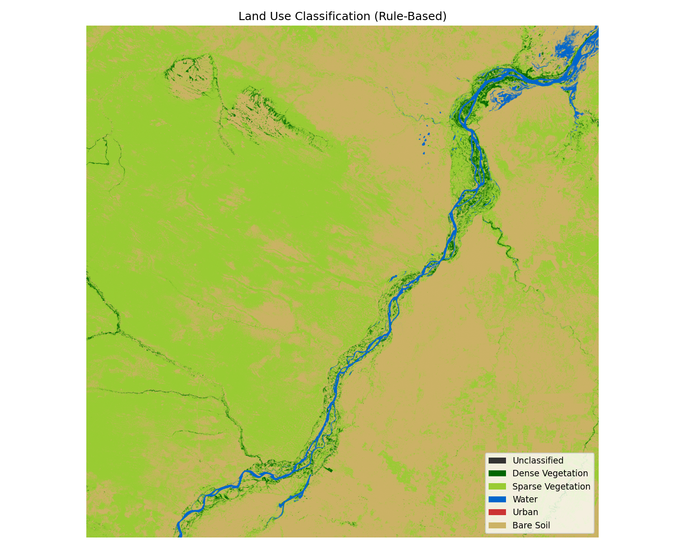

# land-cover-classification
Land cover classification from Sentinel-2 satellite imagery using Python

# Land Use Classification — Sentinel-2

Rule-based land cover classification using Sentinel-2 multispectral imagery.

## Classes
- Dense Vegetation
- Sparse Vegetation
- Water
- Urban
- Bare Soil

## Spectral Indices
- **NDVI** — Normalized Difference Vegetation Index
- **NDWI** — Normalized Difference Water Index
- **BRI** — Blue Reflectance Index

## Requirements
```
pip install -r requirements.txt
```

## How to run
1. Place Sentinel-2 bands (B02, B03, B04, B08) in `data_raw/`
2. Run:
```
python main.py
```
3. Results will be saved in `outputs/`

## Result


## Tools
Python · Rasterio · NumPy · Matplotlib

## Data source
Sentinel-2 — [Copernicus Browser](https://browser.dataspace.copernicus.eu)
